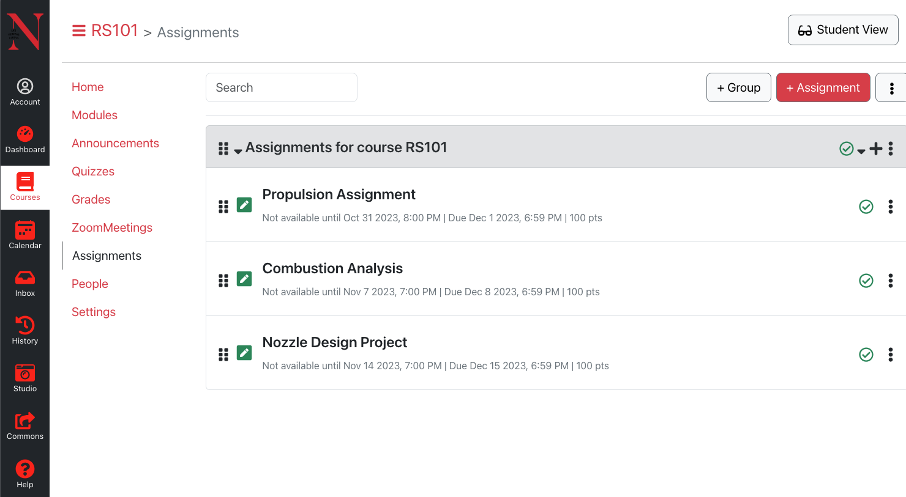

# Kanban Full-Stack Application

This project is a Kanban-style task management web application, built with React.js and Redux on the frontend, Node.js on the backend, and MongoDB as the data store. The application allows users to create, update, and organize tasks in a visually appealing interface, designed with Bootstrap and FontAwesome. It's deployed on Netlify for live interaction.

## Frontend Deployed to Netlify
Access the live application here:
https://cs5610-react-kanbas.netlify.app/#/Kanbas/Dashboard



## Highlights
- Managed local component state in React using state and effect hooks for isolated state management.
- Integrated Redux for managing global application state, ensuring consistency and predictability across the application.
- Established a Node.js backend that interfaces with MongoDB for persistent CRUD operations.
- Deployed the application on Netlify, demonstrating the ability to manage and deploy web applications in a live environment.

## Features

- **React.js**: Powers the dynamic front-end user interface.
- **Redux**: Manages global state for a consistent user experience.
- **Node.js**: Facilitates a robust backend server.
- **MongoDB**: Ensures data persistence and enables CRUD operations.
- **Netlify**: Hosts the application, enabling real-world accessibility.
- **Bootstrap**: Provides a responsive layout and design.
- **FontAwesome**: Enhances the UI with attractive icons.

## Local Development Setup

Before setting up the project locally, ensure Node.js, npm (or yarn), and MongoDB are installed on your machine.

1. Clone the repository:
   ```sh
   git clone https://github.com/your-username/kanban-app.git
   cd kanban-app
   ```

## Deployment
The project is deployed on Netlify with continuous deployment from the main branch. To deploy your own version, follow these steps:

Build your React application:
```sh
npm run build
```
Connect your GitHub repository to Netlify.

Configure your build settings and deploy.

## Process
This project is still a work in progress. More features and improvements are coming soon!